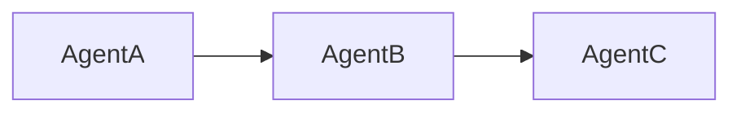
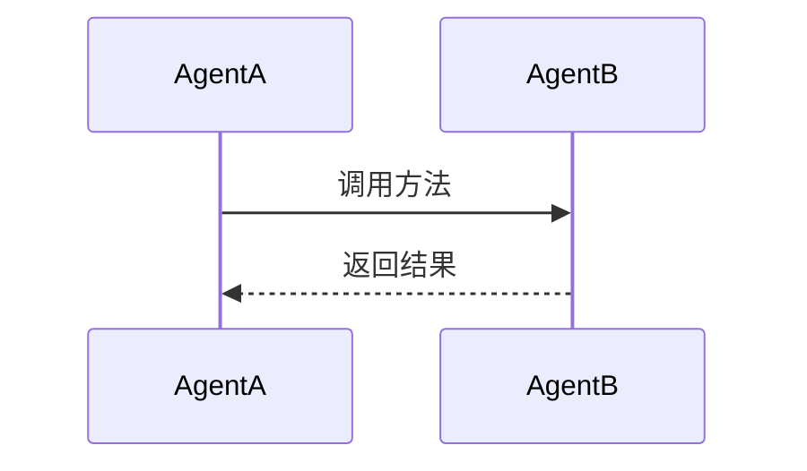

# VennCLAW 任务指令 - 任务 2：Agent 协作分析

**任务 ID**: task-20260310-002-P2  
**优先级**: P0 (最高)  
**执行 Agent**: Claude Code (快速)  
**预计 Token**: 2000-4000  
**依赖**: 任务 1 已完成 ✅  

---

## 📋 任务描述

基于任务 1 的工程结构分析，深入分析 3 个 Agent 之间的协作关系和交互流程。

---

## 🎯 具体目标

1. **分析每个 Agent 的职责边界**
   - 读取 `agents/*/` 目录下的核心代码
   - 识别每个 Agent 的输入/输出
   - 确定 Agent 之间的依赖关系

2. **追踪 Agent 交互方式**
   - 搜索关键词：`call`, `invoke`, `send`, `receive`, `publish`, `subscribe`
   - 查找 Agent 之间的调用关系
   - 识别数据流转路径

3. **绘制协作流程图**
   - 使用 Mermaid 语法
   - 展示完整的请求处理链路

---

## 📄 输出要求

**格式**: Markdown  
**保存路径**: `/root/WORK/VennCLAW/docs/feishu-imports/02-Agent 协作分析报告.md`

**必须包含的章节**:
```markdown
# Agent 协作分析报告

## Agent 列表
| Agent 名称 | 路径 | 主要职责 | 输入 | 输出 |
|-----------|------|---------|------|------|
| BookContent | agents/book_content_agent/ | 书籍分析 | 书籍 ID | 内容特征 |
| ReaderProfile | agents/reader_profile_agent/ | 用户画像 | 用户行为 | 兴趣向量 |
| RecRanking | agents/rec_ranking_agent/ | 推荐排序 | 候选集 + 画像 | 排序结果 |

## 依赖关系


## 交互流程


## 关键发现
- [列出 5-8 个重要发现]
```

---

## ⚠️ 注意事项

1. **参考任务 1 报告** - 基于已识别的 Agent 位置
2. **聚焦交互逻辑** - 不深入具体算法实现
3. **使用 Mermaid 图表** - 可视化协作关系
4. **控制 Token 消耗** - 目标 3000 以内

---

## ✅ 验收标准

报告能回答以下问题：
- [ ] 每个 Agent 的职责是什么？
- [ ] Agent 之间如何调用？
- [ ] 数据如何流转？
- [ ] 完整的请求处理链路是什么？

---

**开始执行时间**: 收到指令后立即开始  
**汇报方式**: 完成后保存文件
