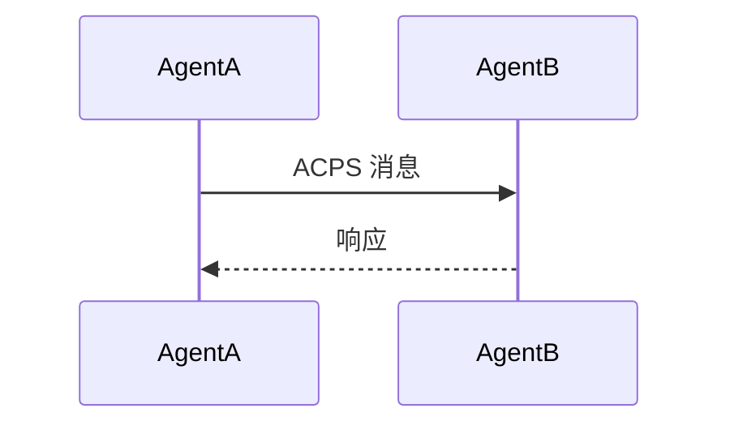

# VennCLAW 任务指令 - 任务 3：ACPS 协议分析

**任务 ID**: task-20260310-003-P3  
**优先级**: P1 (高)  
**执行 Agent**: Codex (主力分析员)  
**预计 Token**: 1500-3000  
**依赖**: 任务 1 已完成 ✅  

---

## 📋 任务描述

分析 ACPs 工程中的 ACPS 协议实现和使用方式。

---

## 🎯 具体目标

1. **定位协议相关文件**
   - 全局搜索关键词：`ACPS`, `acps`, `Acps`, `protocol`, `Protocol`
   - 查找协议定义文件：`*protocol*.py`, `*message*.py`, `*packet*.py`
   - 定位协议目录：`proto/`, `protocol/`

2. **分析协议结构**
   - 识别协议字段定义（类属性、dataclass、TypedDict）
   - 分析序列化/反序列化方法
   - 理解协议报文格式

3. **追踪协议使用场景**
   - 哪些 Agent 调用了 ACPS 协议？
   - 在什么场景下调用？
   - 关键参数和返回值

---

## 📄 输出要求

**格式**: Markdown  
**保存路径**: `/root/WORK/VennCLAW/docs/feishu-imports/03-ACPS 协议分析报告.md`

**必须包含的章节**:
```markdown
# ACPS 协议分析报告

## 协议概览
- 协议文件：[路径]
- 消息类型：X 种

## 关键字段
| 字段名 | 类型 | 说明 |
|-------|------|------|
| field1 | str | 描述 |

## 使用场景
| Agent | 方法 | 协议类型 | 用途 |
|-------|------|---------|------|
| AgentA | send() | Request | 发送请求 |

## 协议流程


## 关键发现
- [列出 5-8 个重要发现]
```

---

## ⚠️ 注意事项

1. **参考任务 1 的 Agent 列表** - 追踪每个 Agent 的协议使用
2. **聚焦协议字段和流程** - 不深入业务逻辑
3. **使用 Mermaid 图表** - 可视化协议交互
4. **控制 Token 消耗** - 目标 2500 以内

---

## ✅ 验收标准

报告能回答以下问题：
- [ ] ACPS 协议有哪些字段？
- [ ] 谁在用这个协议？
- [ ] 在什么场景下使用？
- [ ] 协议交互流程是什么？

---

**开始执行时间**: 收到指令后立即开始  
**汇报方式**: 完成后保存文件
