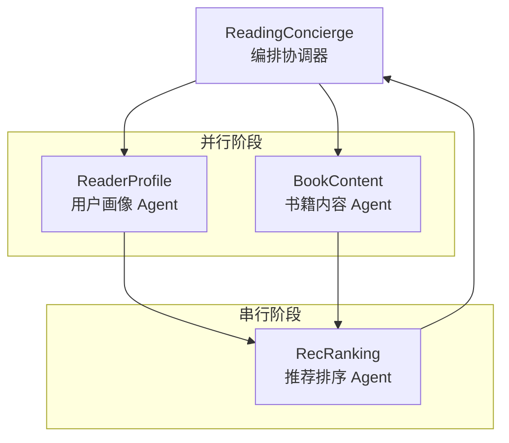
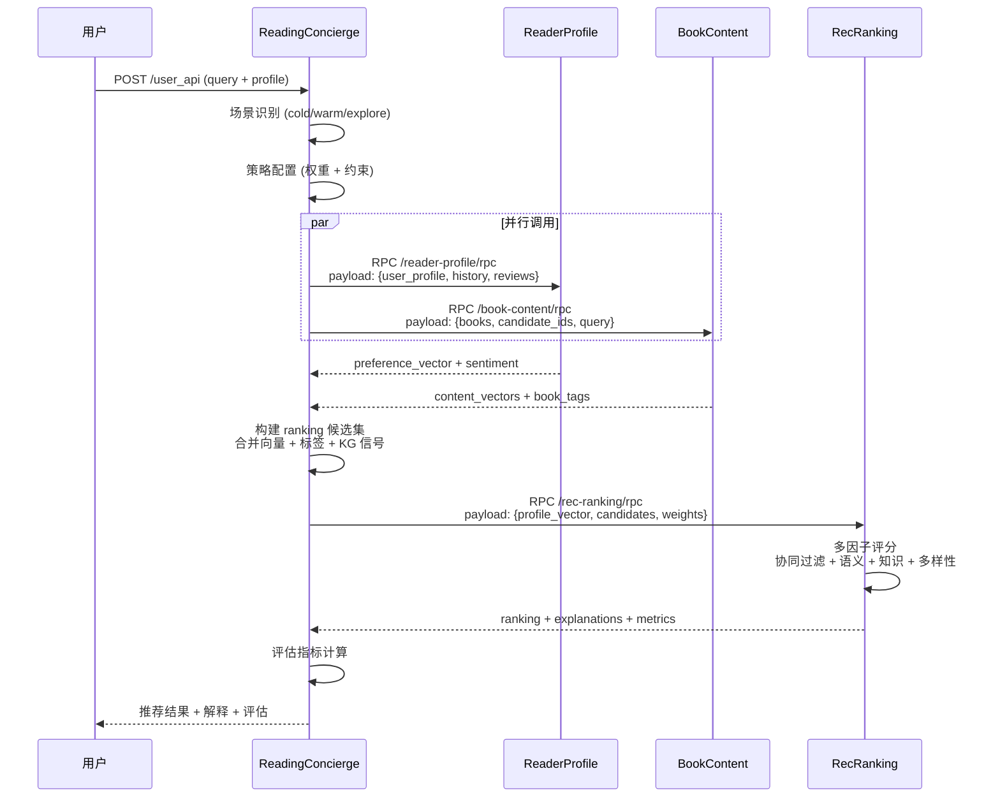
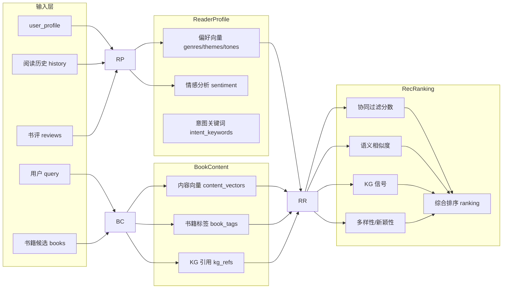

# Agent 协作分析报告

**工程路径**: /root/WORK/SCHOOL/ACPs-app  
**分析时间**: 2026-03-10 08:12 GMT+8  
**基于任务**: task-20260310-002-P2  

---

## Agent 列表

| Agent 名称 | 路径 | 主要职责 | 输入 | 输出 |
|-----------|------|---------|------|------|
| ReaderProfile | agents/reader_profile_agent/ | 用户画像构建 | user_profile, history, reviews | preference_vector, sentiment_summary |
| BookContent | agents/book_content_agent/ | 书籍内容分析 | books, candidate_ids, query | content_vectors, book_tags, kg_refs |
| RecRanking | agents/rec_ranking_agent/ | 推荐排序决策 | profile_vector, candidates, constraints | ranking, explanations, metrics |
| ReadingConcierge | reading_concierge/ | 编排协调器 (Leader) | query, user_profile, history | 完整推荐结果 + 评估指标 |

---

## 依赖关系



---

## 交互流程



---

## 数据流转



---

## 关键发现

1. **三层架构**: ReadingConcierge 作为 Leader 编排，3 个 Agent 作为 Partner 并行/串行执行

2. **并行优化**: ReaderProfile 和 BookContent 可并行调用，RecRanking 需等待两者结果

3. **RPC 通信**: 所有 Agent 通过 AIP RPC 协议通信，支持本地调用和远程发现

4. **场景感知**: 系统识别 cold/warm/explore 三种场景，动态调整排序权重

5. **多因子评分**: RecRanking 使用 4 个信号源 (协同 25% + 语义 35% + 知识 20% + 多样性 20%)

6. **KG 集成**: BookContent 从知识图谱提取作者/流派节点，增强内容理解

7. **降级策略**: 支持远程/本地双模式，远程失败时自动降级到本地 Agent

8. **端点配置**:
   - ReaderProfile: `:8211` / `/reader-profile/rpc`
   - BookContent: `:8212` / `/book-content/rpc`
   - RecRanking: `:8213` / `/rec-ranking/rpc`
   - ReadingConcierge: `:8100` / `/user_api`

---

## 请求处理链路总结

```
用户请求 → ReadingConcierge(场景识别) 
         → [ReaderProfile + BookContent] 并行 
         → RecRanking(多因子排序) 
         → 返回推荐结果
```
