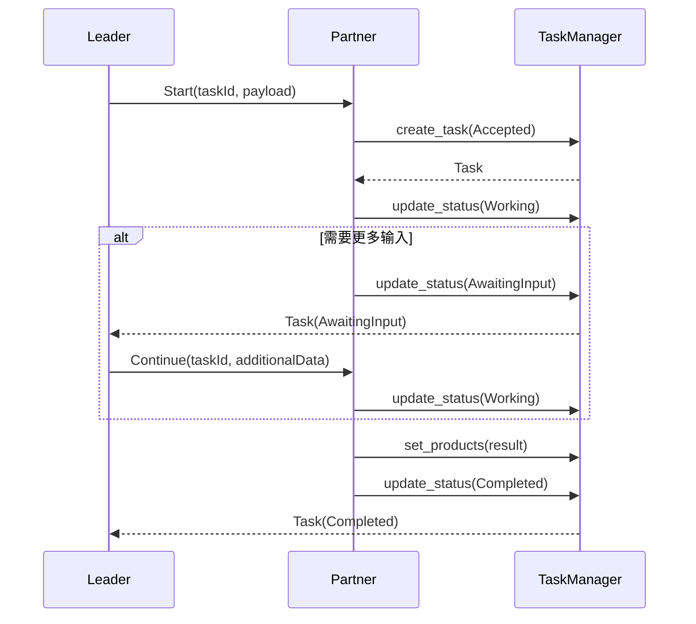
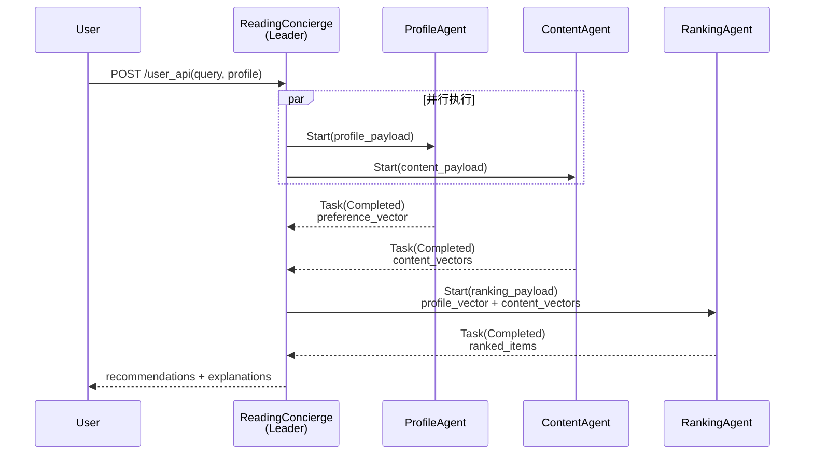
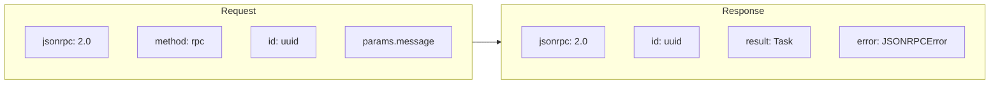

# ACPS 协议分析报告

## 协议概览

- **协议文件**: `/root/WORK/SCHOOL/ACPs-app/acps_aip/`
  - `aip_base_model.py` - 核心数据模型定义
  - `aip_rpc_model.py` - JSON-RPC 2.0 封装
  - `aip_rpc_client.py` - 客户端实现
  - `aip_rpc_server.py` - 服务端实现
- **消息类型**: 6 种 (TaskState 枚举)
- **协议版本**: AIP (Agent Interoperability Protocol)
- **传输协议**: JSON-RPC 2.0 over HTTP/HTTPS (支持 mTLS)

---

## 关键字段

### Message (消息体)

| 字段名 | 类型 | 说明 |
|-------|------|------|
| id | str | 消息唯一标识 |
| sentAt | str | ISO8601 时间戳 |
| senderRole | "leader"\|"partner" | 发送者角色 |
| senderId | str | 发送者 Agent ID |
| command | TaskCommand | 命令类型 (Start/Get/Continue/Cancel/Complete) |
| commandParams | Dict | 命令参数 |
| dataItems | List[DataItem] | 数据负载 |
| taskId | str | 关联任务 ID |
| sessionId | str | 会话 ID |

### Task (任务)

| 字段名 | 类型 | 说明 |
|-------|------|------|
| id | str | 任务唯一标识 |
| status | TaskStatus | 当前状态 |
| products | List[Product] | 产出物 |
| messageHistory | List[Message] | 消息历史 |
| statusHistory | List[TaskStatus] | 状态历史 |
| groupId | str | 组 ID (可选) |
| sessionId | str | 会话 ID |

### TaskState (任务状态)

| 状态 | 说明 |
|------|------|
| accepted | 任务已接受 |
| working | 处理中 |
| awaiting-input | 等待输入 |
| awaiting-completion | 等待完成确认 |
| completed | 已完成 |
| canceled | 已取消 |
| failed | 失败 |
| rejected | 已拒绝 |

### DataItem (数据项)

| 类型 | 字段 | 说明 |
|------|------|------|
| text | text: str | 文本数据 |
| file | name, mimeType, uri, bytes | 文件数据 |
| data | data: Dict | 结构化数据 |

---

## 使用场景

| Agent | 方法 | 协议类型 | 用途 |
|-------|------|---------|------|
| ReaderProfileAgent | handle_start/handle_continue | Start/Continue | 用户画像分析 |
| BookContentAgent | handle_start/handle_continue | Start/Continue | 书籍内容向量化 |
| RecRankingAgent | handle_start/handle_continue | Start/Continue | 推荐排序 |
| ReadingConcierge | _invoke_partner_with_fallback | Start (Leader) | 编排协调 3 个 Partner Agent |

---

## 协议流程

### 标准任务生命周期

### Reading Concierge 编排流程

### JSON-RPC 请求/响应结构

---

## 关键发现

1. **协议分层清晰**: 基础模型 (aip_base_model) 与 RPC 传输 (aip_rpc_model) 分离，便于扩展

2. **状态机驱动**: TaskState 枚举定义了完整的任务生命周期，支持多轮交互 (AwaitingInput)

3. **Leader-Partner 架构**: ReadingConcierge 作为 Leader 协调 3 个 Partner Agent，实现关注点分离

4. **双模式部署**: 支持本地调用 (FastAPI app) 和远程 RPC (HTTP/HTTPS + mTLS)，通过 PARTNER_MODE 配置切换

5. **数据承载灵活**: DataItem 支持 text/file/structured 三种类型，Product 可包含多个 DataItem

6. **命令可扩展**: CommandHandlers 框架允许 Agent 自定义 Start/Continue/Cancel 等行为

7. **错误处理完善**: JSONRPCError 标准化错误码，任务失败时自动更新状态为 Failed

8. **会话上下文**: sessionId 和 taskId 分离，支持单会话多任务场景

---

## 协议特点总结

| 特性 | 实现方式 |
|------|---------|
| 传输协议 | JSON-RPC 2.0 over HTTP |
| 安全 | mTLS (可选) |
| 序列化 | Pydantic BaseModel |
| 任务管理 | 内存 TaskManager (可扩展为持久化) |
| 编排模式 | Leader-Partner (1 对多) |
| 容错 | 远程失败自动降级到本地 |

---

*报告生成时间: 2026-03-10*
