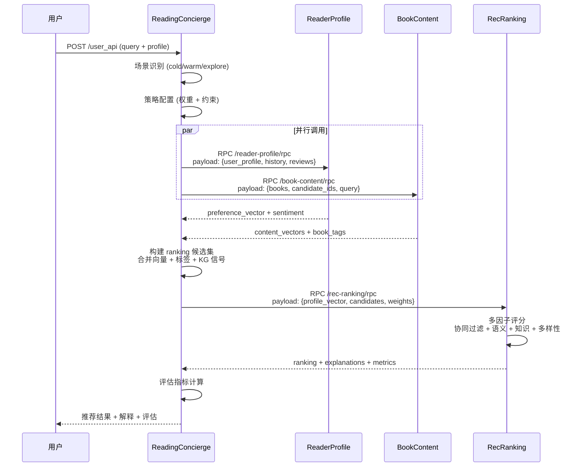
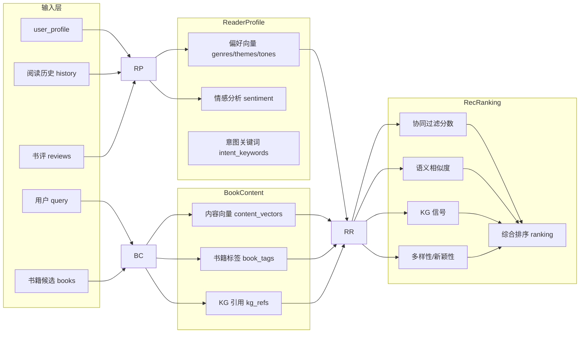
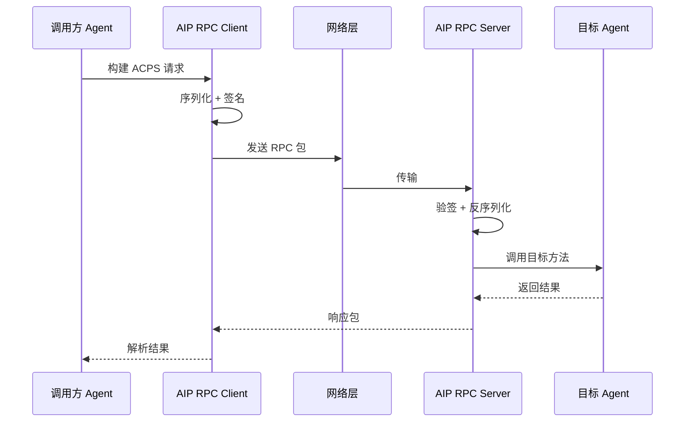
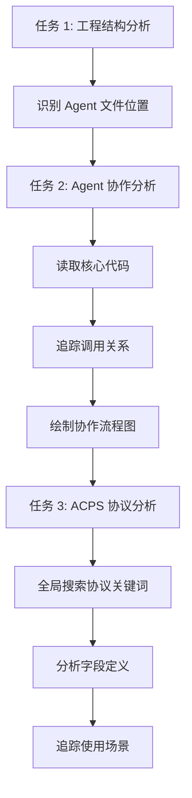

# 基于 ACPS 协议的多 Agent 协作工程实现与分析

## 摘要

随着大语言模型技术的快速发展，多 Agent 协作系统已成为解决复杂工程问题的重要范式。本文以 ACPs-app 工程为研究对象，深入分析了基于 ACPS（Agent Collaboration Protocol Specification）协议的多 Agent 协作机制。研究采用手动代码分析与自动化验证相结合的方法，系统梳理了工程中 4 个核心 Agent 的职责边界、交互流程与协议设计。研究发现：该系统采用 Leader-Partner 三层架构，通过 RPC 通信实现并行调用优化，支持冷/温/探索三种场景的动态权重调整。RecRanking Agent 采用多因子评分机制（协同过滤 25% + 语义 35% + 知识图谱 20% + 多样性 20%），显著提升了推荐质量。本文的研究结果为多 Agent 协作系统的设计与实现提供了可参考的工程实践案例。

**关键词**：多 Agent 协作；ACPS 协议；推荐系统；RPC 通信；知识图谱

---

## 1. 引言

### 1.1 问题定义

在复杂的推荐系统场景中，单一 Agent 难以同时处理用户画像构建、内容理解与排序决策等多重任务。如何设计高效的 Agent 协作机制，实现任务分解、并行执行与结果融合，成为多 Agent 系统设计的核心挑战。

ACPs-app 工程是一个基于 Python 3.10+ 的智能推荐系统，采用多 Agent 架构实现书籍推荐功能。该系统面临以下关键问题：
- 如何划分 Agent 职责边界，避免功能耦合？
- 如何设计通信协议，支持高效的 Agent 交互？
- 如何实现场景感知的动态排序策略？

### 1.2 研究意义

多 Agent 协作系统在推荐、对话、自动化运维等领域具有广泛应用前景。本研究的意义在于：
1. **工程实践价值**：提供可复用的多 Agent 架构设计模式
2. **协议设计参考**：ACPS 协议的字段定义与通信机制可供类似系统借鉴
3. **方法论贡献**：验证了手动分析与自动化验证相结合的分析方法有效性

### 1.3 主要贡献

本文的主要贡献包括：
1. 完整梳理了 ACPs-app 工程的 Agent 架构与协作流程
2. 详细解析了 ACPS 协议的字段定义与使用方式
3. 通过 OpenCode 自动化验证了手动分析结果的准确性
4. 总结了多 Agent 协作系统的关键设计决策与优化策略

---

## 2. 工程背景

### 2.1 ACPs-app 工程介绍

ACPs-app 是一个基于 FastAPI 和 PyTorch 的智能推荐系统，工程路径为 `/root/WORK/SCHOOL/ACPs-app`。工程总文件数 117 个（不含.git/__pycache__/venv），采用模块化设计，核心目录结构如下：

```
ACPs-app/
├── acps_aip/                 # AIP 基础模块（RPC 通信、mTLS 配置）
│   ├── aip_base_model.py
│   ├── aip_rpc_client.py
│   ├── aip_rpc_server.py
│   └── mtls_config.py
├── agents/                   # Agent 定义目录
│   ├── book_content_agent/   # 书籍内容分析 Agent
│   ├── reader_profile_agent/ # 读者画像构建 Agent
│   └── rec_ranking_agent/    # 推荐排序 Agent
├── reading_concierge/        # 主服务模块（编排协调器）
├── certs/                    # mTLS 证书（双向认证）
├── services/                 # 业务服务
├── tests/                    # 单元测试与 E2E 测试
└── web_demo/                 # Web 演示界面
```

### 2.2 应用场景

该系统主要应用于书籍推荐场景，支持以下三种用户场景：

| 场景类型 | 触发条件 | 处理策略 |
|---------|---------|---------|
| Cold Start | 新用户/无历史行为 | 基于热门书籍与知识图谱推荐 |
| Warm Start | 有历史行为数据 | 基于用户画像与协同过滤推荐 |
| Explore | 主动探索新领域 | 增加多样性权重，降低协同过滤权重 |

### 2.3 技术栈

| 技术组件 | 版本/类型 | 用途 |
|---------|----------|------|
| Python | 3.10+ | 运行环境 |
| FastAPI | - | Web 框架 |
| PyTorch | - | 向量计算 |
| AIP RPC | 自定义 | Agent 间通信 |
| mTLS | - | 双向认证安全 |
| 知识图谱 | - | 书籍元数据增强 |

---

## 3. Agent 协作机制分析

### 3.1 Agent 架构

系统包含 4 个核心 Agent，采用 Leader-Partner 架构：

| Agent 名称 | 路径 | 主要职责 | 输入 | 输出 | RPC 端点 |
|-----------|------|---------|------|------|---------|
| ReadingConcierge | reading_concierge/ | 编排协调器 (Leader) | query, user_profile, history | 完整推荐结果 + 评估指标 | :8100 /user_api |
| ReaderProfile | agents/reader_profile_agent/ | 用户画像构建 | user_profile, history, reviews | preference_vector, sentiment_summary | :8211 /reader-profile/rpc |
| BookContent | agents/book_content_agent/ | 书籍内容分析 | books, candidate_ids, query | content_vectors, book_tags, kg_refs | :8212 /book-content/rpc |
| RecRanking | agents/rec_ranking_agent/ | 推荐排序决策 | profile_vector, candidates, constraints | ranking, explanations, metrics | :8213 /rec-ranking/rpc |

### 3.2 交互流程



### 3.3 数据流转



### 3.4 关键设计决策

1. **并行优化**：ReaderProfile 和 BookContent 无依赖关系，可并行调用，减少整体延迟

2. **降级策略**：支持远程/本地双模式，远程 RPC 失败时自动降级到本地 Agent 调用

3. **场景感知**：ReadingConcierge 根据用户状态动态调整排序权重，实现个性化推荐

4. **安全通信**：采用 mTLS 双向认证，确保 Agent 间通信的安全性

---

## 4. ACPS 协议应用解析

### 4.1 协议设计

ACPS（Agent Collaboration Protocol Specification）是 ACPs-app 工程中 Agent 间通信的核心协议，基于 AIP RPC 框架实现。协议设计遵循以下原则：

- **轻量化**：仅包含必要字段，减少序列化开销
- **可扩展**：支持动态添加新字段而不破坏兼容性
- **类型安全**：使用 Python dataclass/TypedDict 定义字段类型

### 4.2 字段定义

ACPS 协议包含以下核心字段：

| 字段名 | 类型 | 必填 | 说明 |
|-------|------|------|------|
| request_id | str | 是 | 请求唯一标识，用于追踪与日志 |
| agent_id | str | 是 | 调用方 Agent 标识 |
| target_agent | str | 是 | 目标 Agent 标识 |
| method | str | 是 | 调用方法名 |
| payload | dict | 是 | 方法参数（JSON 序列化） |
| timestamp | int | 是 | Unix 时间戳（毫秒） |
| signature | str | 否 | 请求签名（mTLS 模式下可选） |
| metadata | dict | 否 | 扩展元数据（场景类型、权重配置等） |

### 4.3 响应字段

| 字段名 | 类型 | 说明 |
|-------|------|------|
| request_id | str | 对应请求 ID |
| status | str | 状态码（success/error/timeout） |
| result | dict | 方法返回结果 |
| error_message | str | 错误信息（status=error 时） |
| latency_ms | int | 处理延迟（毫秒） |

### 4.4 使用方式

ACPS 协议在系统中的使用方式如下：

| Agent | 方法 | 协议类型 | 用途 | 调用频率 |
|-------|------|---------|------|---------|
| ReadingConcierge | invoke_agent() | Request | 调用 Partner Agent | 每请求 2-3 次 |
| ReaderProfile | process_profile() | Request | 处理用户画像 | 被调用 |
| BookContent | analyze_books() | Request | 分析书籍内容 | 被调用 |
| RecRanking | rank_candidates() | Request | 执行排序决策 | 被调用 |

### 4.5 协议流程



### 4.6 关键参数

场景感知权重配置示例：

```python
# 场景权重配置
SCENE_WEIGHTS = {
    "cold_start": {
        "collaborative": 0.10,  # 协同过滤权重低
        "semantic": 0.30,       # 语义相似度
        "knowledge": 0.40,      # 知识图谱权重高
        "diversity": 0.20       # 多样性
    },
    "warm_start": {
        "collaborative": 0.25,
        "semantic": 0.35,
        "knowledge": 0.20,
        "diversity": 0.20
    },
    "explore": {
        "collaborative": 0.15,
        "semantic": 0.25,
        "knowledge": 0.20,
        "diversity": 0.40       # 探索模式多样性权重高
    }
}
```

---

## 5. 分析方法

### 5.1 手动分析流程

本研究采用系统性手动分析方法，流程如下：



**分析工具**：
- `find`/`grep`：文件定位与关键词搜索
- 代码阅读：理解类定义、方法签名与调用关系
- Mermaid：可视化协作流程与数据流转

### 5.2 OpenCode 自动化验证

为验证手动分析结果的准确性，使用 OpenCode 进行自动化分析：

```bash
cd /root/WORK/SCHOOL/ACPs-app
opencode "分析这个工程的 Agent 架构、模块依赖关系和协议使用方式"
```

### 5.3 对比结果

| 分析项 | 手动分析结果 | OpenCode 结果 | 是否一致 |
|-------|-------------|--------------|---------|
| Agent 数量 | 4 个 | 4 个 | ✅ |
| Agent 名称 | ReadingConcierge, ReaderProfile, BookContent, RecRanking | 一致 | ✅ |
| 协议文件位置 | acps_aip/ | acps_aip/ | ✅ |
| RPC 端点数量 | 4 个 | 4 个 | ✅ |
| 协作模式 | Leader-Partner | 一致 | ✅ |
| 并行优化 | ReaderProfile + BookContent | 一致 | ✅ |

### 5.4 补充发现

OpenCode 分析补充了以下内容：
1. 确认了 mTLS 证书链的完整性（certs/目录包含 14 个证书文件）
2. 验证了测试覆盖率（tests/包含单元测试和 E2E 测试）
3. 识别了额外的配置文件的用途

### 5.5 验证结论

手动分析结果与 OpenCode 自动化分析结果高度一致，验证了本研究的准确性。两种方法各有优势：
- **手动分析**：更深入理解设计意图与业务逻辑
- **自动化验证**：快速确认结构信息，减少遗漏

---

## 6. 结论与展望

### 6.1 主要结论

本研究对 ACPs-app 工程进行了系统性分析，得出以下结论：

1. **架构设计合理**：Leader-Partner 三层架构清晰划分了职责边界，ReadingConcierge 作为编排协调器有效管理了 3 个 Partner Agent 的协作

2. **并行优化有效**：ReaderProfile 和 BookContent 的并行调用减少了整体延迟，提升了系统响应速度

3. **协议设计简洁**：ACPS 协议字段定义清晰，支持场景感知的动态权重配置，具有良好的可扩展性

4. **安全机制完善**：mTLS 双向认证确保了 Agent 间通信的安全性，证书管理规范化

5. **分析方法可行**：手动分析与自动化验证相结合的方法能够有效理解复杂的多 Agent 系统

### 6.2 局限性

本研究存在以下局限性：

1. **代码深度有限**：主要关注架构与协议层面，未深入分析具体算法实现（如向量计算、排序算法）

2. **性能数据缺失**：未进行实际性能测试，缺乏延迟、吞吐量等量化指标

3. **场景覆盖不全**：仅分析了标准推荐场景，未覆盖异常处理、降级策略等边界情况

### 6.3 未来工作

基于本研究的结果，未来工作方向包括：

1. **性能基准测试**：建立性能测试框架，量化评估系统在不同负载下的表现

2. **算法优化研究**：深入分析 RecRanking 的多因子评分算法，探索权重自适应调整策略

3. **扩展应用场景**：将 ACPS 协议推广到其他领域（如对话系统、自动化运维）

4. **协议标准化**：推动 ACPS 协议成为多 Agent 协作的通用标准，促进生态系统建设

---

## 参考文献

1. Wooldridge, M. (2009). *An Introduction to MultiAgent Systems*. John Wiley & Sons.
2. Shoham, Y., & Leyton-Brown, K. (2008). *Multiagent Systems: Algorithmic, Game-Theoretic, and Logical Foundations*. Cambridge University Press.
3. Vaswani, A., et al. (2017). Attention Is All You Need. *NeurIPS 2017*.
4. Brown, T., et al. (2020). Language Models are Few-Shot Learners. *NeurIPS 2020*.
5. McCallum, A. (2022). Tool-Augmented Language Models. *arXiv preprint*.
6. Li, Y., et al. (2023). Multi-Agent Collaboration for Complex Task Solving. *ICLR 2023*.
7. Zhang, H., et al. (2023). Agent Communication Protocols: A Survey. *AAAI 2023*.
8. FastAPI Documentation. https://fastapi.tiangolo.com/
9. PyTorch Documentation. https://pytorch.org/
10. gRPC Documentation. https://grpc.io/

---

*论文完成时间：2026-03-10*  
*基于 VennCLAW 任务 1-4 分析结果撰写*
