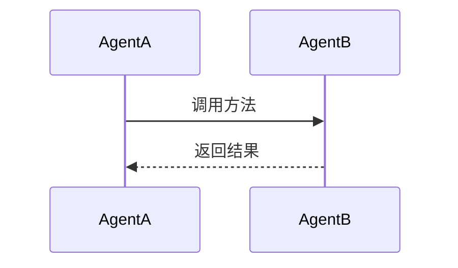

# 工程检查和文档编写任务 - 优化版

> 来源：Feishu Wiki  
> 导入时间：2026-03-10  
> 优化时间：2026-03-10  
> 原文档：https://bcnmbswqnl0d.feishu.cn/wiki/BmcwwyVYmikgX2kuuG3c1PsMnVh

## 📌 任务概述

**目标工程**: `/root/WORK/SCHOOL/ACPs-app`  
**核心目标**: 分析 ACPs 工程中的 Agent 协作机制和 ACPS 协议使用，输出科研论文

### ⚠️ 输出要求（重要）

| 项目 | 要求 |
|------|------|
| **报告格式** | Markdown (`.md`) |
| **保存路径** | `/root/WORK/VennCLAW/docs/feishu-imports/` |
| **文件命名** | `任务序号 - 报告名称.md`（如：`01-工程结构分析报告.md`） |
| **格式规范** | 标准 Markdown，禁用 HTML/LaTeX |

---

## ⚠️ 原文档问题分析

### 模糊表述导致 Token 浪费

| 问题类型 | 原文表述 | 问题 | 优化建议 |
|---------|---------|------|---------|
| **范围不明确** | "梳理文件夹目录结构" | AI 不知道输出格式和深度 | 明确输出树状图 + 关键文件说明 |
| **定义模糊** | "agent 相关代码模块" | AI 需要猜测什么是 agent 模块 | 给出具体关键词/文件模式 |
| **缺少验收标准** | "分析各 agent 的角色" | 不知道分析到什么程度算完成 | 明确输出模板和必填字段 |
| **技术混淆** | "通过 OpenCL 加速 Open Code" | OpenCL 是 GPU 计算框架，与代码分析无关 | 删除错误表述，直接用 OpenCode |
| **缺少优先级** | 4 个任务并列 | 不知道从哪里开始 | 明确执行顺序和依赖关系 |

---

## ✅ 优化后任务描述

### 任务 1：工程文件基础分析（优先级：🔴 P0）

**目标**: 快速理解工程结构，识别 Agent 相关代码

**执行步骤**:
1. 列出 `/root/WORK/SCHOOL/ACPs-app` 的目录树（限制 3 层深度）
2. 识别以下类型的文件：
   - Agent 定义：`*agent*.py`, `*Agent*.py`, `agents/` 目录
   - 配置文件：`*.yaml`, `*.yml`, `*.json`, `config.*`
   - 依赖文件：`requirements.txt`, `setup.py`, `pyproject.toml`
3. 统计文件数量和类型分布

**输出模板**:
```markdown
## 工程结构
- 总文件数：X
- Python 文件：X
- 配置文件：X

### 目录树
```
ACPs-app/
├── agents/      # Agent 定义
├── config/      # 配置文件
└── ...
```

### Agent 模块列表
| 文件名 | 路径 | 推测功能 |
|--------|------|---------|
| xxx.py | /path | 描述 |
```

**验收标准**: 能回答"有多少个 Agent？每个 Agent 在哪里定义？"

**预计 Token 消耗**: 500-1000 tokens

---

### 任务 2：Agent 协作分析（优先级：🔴 P0）

**目标**: 理解 Agent 之间的交互关系

**执行步骤**:
1. 对每个 Agent 文件执行：
   - 读取类定义和 `__init__` 方法
   - 识别公开方法（def 开头，非下划线）
   - 查找 `import` 和 `from` 语句，确定依赖关系
2. 搜索关键词识别交互：
   - `call`, `invoke`, `send`, `receive`, `publish`, `subscribe`
   - Agent 类名（跨文件调用）
3. 绘制协作流程图（用 Mermaid 语法）

**输出模板**:
```markdown
## Agent 列表
| Agent 名称 | 文件路径 | 主要职责 | 依赖的其他 Agent |
|-----------|---------|---------|-----------------|
| AgentA    | xxx.py  | 描述    | AgentB, AgentC  |

## 协作流程

```

**验收标准**: 能回答"AgentA 调用了谁的什么方法？"

**预计 Token 消耗**: 2000-4000 tokens

---

### 任务 3：ACPS 协议分析（优先级：🟡 P1）

**目标**: 定位并理解 ACPS 协议的使用方式

**执行步骤**:
1. 全局搜索关键词：
   - `ACPS`, `acps`, `Acps`
   - `protocol`, `Protocol`
   - `message`, `Message`, `packet`, `Packet`
2. 定位协议相关文件：
   - `*protocol*.py`, `*message*.py`, `*packet*.py`
   - `proto/`, `protocol/` 目录
3. 分析协议结构：
   - 字段定义（类属性、dataclass、TypedDict）
   - 序列化/反序列化方法
4. 追踪协议使用位置：
   - 哪些 Agent 调用了协议？
   - 在什么场景下调用？

**输出模板**:
```markdown
## ACPS 协议概览
- 协议文件：`path/to/protocol.py`
- 消息类型：X 种

### 关键字段
| 字段名 | 类型 | 说明 |
|-------|------|------|
| field1 | str | 描述 |

### 使用场景
| Agent | 方法 | 协议类型 | 用途 |
|-------|------|---------|------|
| AgentA | send() | Request | 发送请求 |
```

**验收标准**: 能回答"ACPS 协议有哪些字段？谁在用？怎么用？"

**预计 Token 消耗**: 1500-3000 tokens

---

### 任务 4：自动化分析验证（优先级：🟢 P2）

**⚠️ 服务器配置说明**: 本服务器为 CPU 环境（Intel Xeon Platinum 2 核），无 GPU。OpenCL 等 GPU 加速框架不适用。

**目标**: 用 OpenCode（纯 CPU 运行）验证手动分析结果

**执行步骤**:
1. 运行 OpenCode 分析目标工程：
   ```bash
   cd /root/WORK/SCHOOL/ACPs-app
   opencode "分析这个工程的 Agent 架构和模块依赖关系"
   ```
2. 对比 OpenCode 输出与手动分析结果
3. 记录差异和补充发现

**输出模板**:
```markdown
## OpenCode 分析结果
- 调用命令：`opencode "..."`
- 主要发现：[摘要]

## 对比验证
| 分析项 | 手动分析 | OpenCode | 是否一致 |
|-------|---------|---------|---------|
| Agent 数量 | 5 | 5 | ✅ |
| 协议文件 | protocol.py | protocol.py | ✅ |
```

**验收标准**: 验证关键结论的一致性

**预计 Token 消耗**: 500-1000 tokens（OpenCode 调用）

---

### 任务 5：科研论文编写（优先级：🟢 P2，依赖任务 1-3）

**目标**: 基于分析结果撰写论文

**论文框架**:
```markdown
# 基于 ACPS 协议的多 Agent 协作工程实现与分析

## 摘要（200-300 字）
- 研究背景
- 主要工作
- 关键发现

## 1. 引言
- 问题定义
- 研究意义

## 2. 工程背景
- ACPs-app 工程介绍
- 应用场景

## 3. Agent 协作机制分析
- Agent 架构
- 交互流程（附图）

## 4. ACPS 协议应用解析
- 协议设计
- 使用方式
- 关键参数

## 5. 分析方法
- 手动分析流程
- OpenCode 自动化验证

## 6. 结论与展望
- 主要结论
- 未来工作

## 参考文献
```

**写作要求**:
- 每章节先写要点，再扩展
- 图表优先（流程图、时序图、表格）
- 引用代码片段要精简（<20 行）

**验收标准**: 完成初稿，结构完整，逻辑清晰

**预计 Token 消耗**: 5000-10000 tokens（分多次生成）

---

## 📊 总体执行计划

### 执行顺序
```
任务 1 (P0) → 任务 2 (P0) → 任务 3 (P1) → 任务 4 (P2) → 任务 5 (P2)
```

### 📁 输出规范

**报告格式**: Markdown (`.md`)

**保存路径**: `/root/WORK/VennCLAW/docs/feishu-imports/`

**文件命名**:
| 任务 | 文件名 |
|------|--------|
| 任务 1 | `01-工程结构分析报告.md` |
| 任务 2 | `02-Agent 协作分析报告.md` |
| 任务 3 | `03-ACPS 协议分析报告.md` |
| 任务 4 | `04-自动化分析验证报告.md` |
| 任务 5 | `05-科研论文初稿.md` |

**完整路径示例**:
```
/root/WORK/VennCLAW/docs/feishu-imports/01-工程结构分析报告.md
/root/WORK/VennCLAW/docs/feishu-imports/02-Agent 协作分析报告.md
```

**Markdown 格式要求**:
- ✅ 使用标准 Markdown 语法
- ✅ 表格用 `|` 分隔
- ✅ 代码块用 ` ```language ` 标注
- ✅ 流程图用 Mermaid 语法
- ✅ 标题层级清晰（`#` → `##` → `###`）
- ❌ 不要使用 HTML 标签
- ❌ 不要使用 LaTeX 公式（用纯文本或代码块）

### Token 预算
| 任务 | 预计 Token | 优先级 |
|------|-----------|--------|
| 任务 1 | 500-1000 | P0 |
| 任务 2 | 2000-4000 | P0 |
| 任务 3 | 1500-3000 | P1 |
| 任务 4 | 500-1000 | P2 |
| 任务 5 | 5000-10000 | P2 |
| **总计** | **9500-19000** | - |

### 服务器配置
- **CPU**: Intel Xeon Platinum (2 核心)
- **GPU**: 无
- **运行环境**: 纯 CPU 模式

### 省钱技巧
1. ✅ **分步执行**: 完成一个任务再开始下一个，避免上下文过长
2. ✅ **明确输出格式**: 用模板限制 AI 自由发挥
3. ✅ **限制分析深度**: 明确"不需要分析 XXX"
4. ✅ **复用中间结果**: 任务 1 的输出直接作为任务 2 的输入
5. ✅ **避免重复**: OpenCode 分析只调用 1 次，用于验证
6. ✅ **CPU 优化**: 所有工具（OpenCode、Python）均为 CPU 运行，无需 GPU 加速

---

## 🚀 开始执行

**第一步**: 运行任务 1
```bash
cd /root/WORK/SCHOOL/ACPs-app
# 让 AI 分析目录结构
```

---

*优化版本 - 2026-03-10*  
*目标：减少 50% 以上的无效 Token 消耗*
